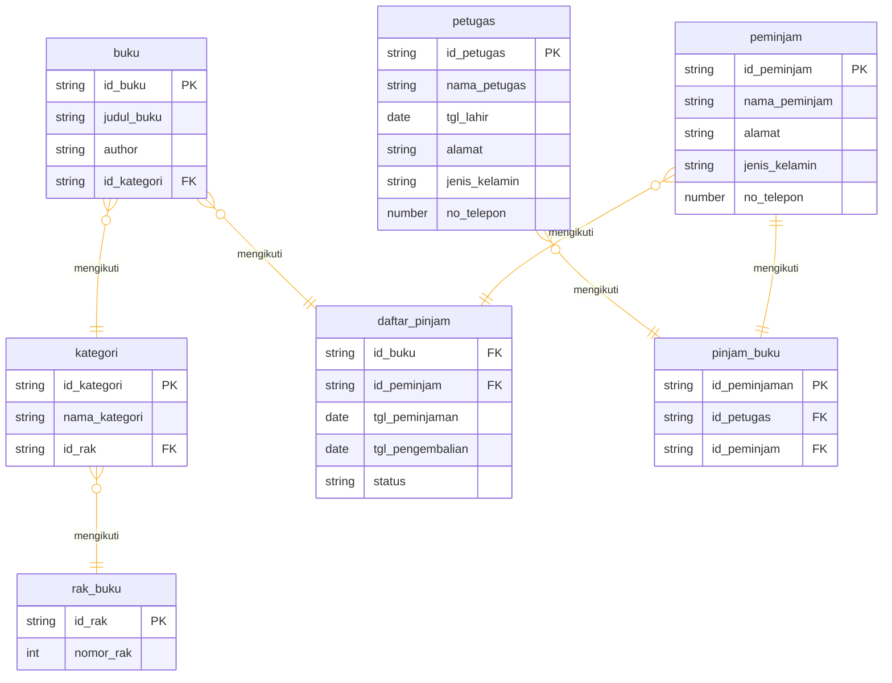

# ERD sisteem perpustakaan

## Berikut merupakan ERD untuk sistem perpustakaan menggunakan mermaid

```mermaid
---
config:
    theme: 'default'
    themeVariables:
        lineColor: '#F8B229'
---

erDiagram
    buku {
        string id_buku PK
        string judul_buku
        string author
        string id_kategori FK
    }
    
    kategori {
        string id_kategori PK
        string nama_kategori
        string id_rak FK
    }
    rak_buku {
        string id_rak PK
        int nomor_rak
    }
    petugas {
        string id_petugas PK
        string nama_petugas
        date tgl_lahir
        string alamat
        string jenis_kelamin
        number no_telepon
    }

    peminjam {
        string id_peminjam PK
        string nama_peminjam
        string alamat
        string jenis_kelamin
        number no_telepon
    }

    daftar_pinjam {
        string id_buku FK
        string id_peminjam FK
        date tgl_peminjaman
        date tgl_pengembalian
        string status
    }

    pinjam_buku {
        string id_peminjaman PK
        string id_petugas FK
        string id_peminjam FK
    }

    buku o{ -- || kategori : mengikuti
    kategori o{ -- || rak_buku : mengikuti
    buku o{ -- || daftar_pinjam : mengikuti
    peminjam o{ -- || daftar_pinjam : mengikuti
    petugas o{ -- || pinjam_buku : mengikuti
    peminjam || -- || pinjam_buku : mengikuti


```